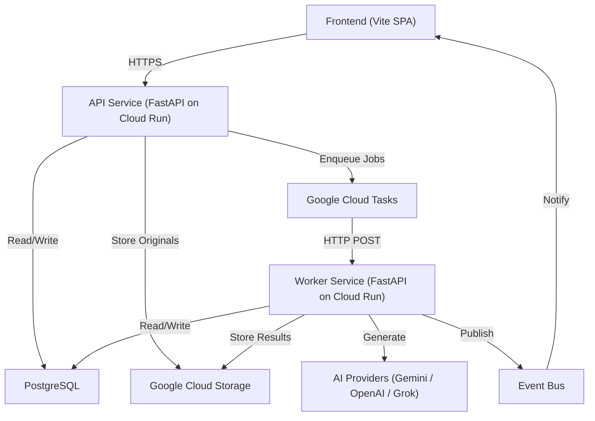

# CropStudio AI — Backend Engineering Specification

> **Version:** 1.0  
> **Status:** Draft — Pending Review  
> **Author:** Architecture Team  
> **Date:** 2026-07-09  

> [!IMPORTANT]
> This document is the **single source of truth** for all backend implementation. Every future coding task, module build, and AI agent prompt MUST reference this specification. No backend code should be written that contradicts the principles, patterns, or responsibilities defined here.

---

## 1. Product Vision

CropStudio AI transforms raw mobile product photos into premium, marketplace-ready ecommerce imagery using Generative AI. The platform serves Indian fashion brands and ecommerce sellers who need professional product photography at scale without a physical studio.

**Core value proposition:** Upload a phone photo of your product → receive studio-quality images ready for Amazon, Flipkart, Myntra, Ajio, Shopify, WooCommerce, and Meesho.

**Initial categories:** Clothing (T-Shirts, Shirts, Jeans, Dresses, Sarees, Hoodies), Shoes, Watches, Bags.

**Architecture constraint:** The system MUST be category-agnostic at the infrastructure level. Categories are configuration, not code. Adding Furniture, Electronics, Kitchen, Home Decor, Cosmetics, Jewelry, or Toys must require zero backend code changes — only new prompt templates and optional preprocessing configs.

---

## 2. Goals

### Engineering Goals
- Process **100,000+ images/day** at steady state
- **Sub-5-second API response** for all synchronous endpoints (upload, status, history)
- **< 60 second median generation latency** per image (provider-dependent)
- **99.9% uptime** for the API layer
- **Zero data loss** — every uploaded image and generated result must be durable
- **Horizontal scalability** — add workers to increase throughput linearly

### Architecture Goals
- **Modular monolith** that can migrate to microservices without rewriting business logic
- **Provider-agnostic** — swap or add AI providers by implementing a single interface
- **Storage-agnostic** — swap cloud storage by implementing a single interface
- **Queue-agnostic** — swap task queues by implementing a single interface
- **Test coverage > 80%** on all service and domain layers

### Business Goals
- Support freemium, pro, and enterprise subscription tiers
- Track per-user, per-provider, and per-generation-mode costs accurately
- Enable feature flags for gradual rollouts
- Provide admin APIs for operations, analytics, and customer support

---

## 3. Functional Requirements

### Image Upload
- Upload a single image with metadata (category, generation mode)
- Upload a batch of images (up to 50 per batch initially, configurable)
- Validate file type (JPEG, PNG, WebP, HEIC), file size (max 25MB), and dimensions
- Generate a unique job ID per image, a unique batch ID per batch
- Store the original image in cloud storage immediately upon upload
- Return a presigned upload URL for large files (client-side upload path)

### Image Generation
- Support modes: Background Removal, White Background, Transparent PNG, Lifestyle, Flat Lay, Ghost Mannequin, Folded, Hanging, Close-up, Product Showcase, Hero Image, Virtual Try-On
- Each mode is a **Strategy** — self-contained with its own prompt template, preprocessing, and postprocessing
- A single image can be processed through multiple modes in one batch
- Each mode produces 1–6 variations (configurable per mode)
- Generation is **always asynchronous** — the API enqueues work, never executes it

### Prompt Management
- Store prompt templates per generation mode
- Version prompts — every change creates a new version, old versions are immutable
- Associate each generated image with the exact prompt version used
- Support prompt variables (e.g., `{product_category}`, `{background_style}`)

### AI Provider Routing
- Route generation requests to a specific provider or let the system auto-select
- Auto-selection considers: provider availability, cost, latency, quality score, rate limits
- If the primary provider fails, automatically fall back to the next provider
- Track every provider request: model used, tokens consumed, latency, cost, success/failure

### Job Lifecycle
- States: `pending` → `queued` → `processing` → `completed` | `failed` | `cancelled`
- Query job status by job ID
- Query batch status by batch ID (aggregate of all jobs)
- Cancel a pending or queued job
- Retry a failed job (creates a new attempt, preserves history)
- Jobs are **idempotent** — processing the same job twice produces the same result or safely no-ops

### Storage & Delivery
- Store originals and generated images in cloud storage
- Generate short-lived signed URLs for image access (never expose raw storage paths)
- Support bulk download as a ZIP archive (generated on-demand or pre-built)

### User Management
- Authentication via Supabase Auth (email/password, Google OAuth, phone OTP)
- User profiles with subscription tier, usage quotas, and preferences
- Per-user usage tracking: images uploaded, images generated, credits consumed

### Billing & Subscriptions
- Define subscription plans with monthly quotas (images/month, batch size, modes available)
- Track credit consumption per generation
- Enforce quota limits before enqueueing work
- Support plan upgrades/downgrades

### Admin & Operations
- Admin API for: user management, job inspection, provider health, system metrics
- Feature flags for: new modes, new providers, UI experiments, quota overrides
- Audit log for: every state change, every admin action, every provider request

---

## 4. Non-Functional Requirements

| Requirement | Target |
|---|---|
| **Throughput** | 100,000 images/day (~1.16 images/second sustained) |
| **API Latency (p99)** | < 500ms for synchronous endpoints |
| **Generation Latency (median)** | < 60s per image |
| **Availability** | 99.9% for API, 99.5% for workers |
| **Durability** | Zero image loss (cloud storage with redundancy) |
| **Consistency** | Eventually consistent for generation results; strongly consistent for billing |
| **Scalability** | Horizontal — add Cloud Run instances or worker replicas |
| **Security** | OWASP Top 10 compliance, signed URLs, input sanitization |
| **Testability** | All services testable in isolation with mocked dependencies |
| **Deployability** | Zero-downtime deployments via Cloud Run revisions |

---

## 5. High-Level Architecture

### Key Separation
- **API Service:** Handles HTTP requests, authentication, validation, database writes, and task enqueueing. Never calls AI providers directly.
- **Worker Service:** Receives tasks from Cloud Tasks, calls AI providers, stores results, updates the database. Stateless and horizontally scalable.
- **Database:** PostgreSQL — single source of truth for all state.
- **Storage:** Google Cloud Storage — durable blob storage for all images.
- **Queue:** Google Cloud Tasks — reliable task delivery with retry policies.

---

## 6. Technology Decisions

| Layer | Choice | Rationale |
|---|---|---|
| **Language** | Python 3.13+ | Best ecosystem for AI/ML, image processing (Pillow, rembg), and async HTTP |
| **Framework** | FastAPI | Async-native, Pydantic integration, OpenAPI docs, high performance |
| **Database** | PostgreSQL 16 | ACID transactions, JSONB for flexible metadata, mature ecosystem |
| **ORM** | SQLAlchemy 2.0 (async) | Type-safe, async support, repository pattern friendly |
| **Migrations** | Alembic | Standard for SQLAlchemy, supports auto-generation |
| **Auth** | Supabase Auth | Managed auth with JWT, social logins, phone OTP — no custom auth code |
| **Storage** | Google Cloud Storage | Durable, globally distributed, signed URL support |
| **Queue** | Google Cloud Tasks | Managed, at-least-once delivery, automatic retries, HTTP targets |
| **Deployment** | Google Cloud Run | Serverless containers, auto-scaling, pay-per-use |
| **Config** | Pydantic Settings | Type-safe, environment variable loading, validation |
| **Validation** | Pydantic v2 | Fast validation, serialization, OpenAPI schema generation |
| **Testing** | Pytest + pytest-asyncio | Async test support, fixtures, parametrize |
| **Package Mgmt** | uv | Fast, reliable, lockfile support |
| **Linting** | Ruff | Replaces flake8 + isort + black, extremely fast |
| **Type Checking** | mypy (strict mode) | Catch type errors before runtime |
| **Logging** | structlog | Structured JSON logging, context binding, processor pipeline |

---

## 7. Core Modules

Each module is a self-contained domain with clear boundaries. Modules communicate through well-defined service interfaces, never by importing each other's internals.

### 7.1 Auth Module
- Verify Supabase JWT tokens
- Extract user identity and roles from tokens
- Provide FastAPI dependency for authenticated routes
- Define role-based access control (user, admin, service-account)

### 7.2 User Module
- Manage user profiles (synced from Supabase Auth)
- Store user preferences, subscription tier, and quotas
- Provide user context to all downstream services

### 7.3 Upload Module
- Accept and validate image files (type, size, dimensions, corruption check)
- Generate presigned upload URLs for client-direct-to-storage uploads
- Create database records for uploaded images
- Trigger downstream processing

### 7.4 Batch Module
- Group multiple uploads into a logical batch
- Track batch-level status (aggregate of individual job statuses)
- Support batch cancellation (cancel all pending/queued jobs)
- Enforce per-user batch size limits based on subscription tier

### 7.5 Job Module
- Manage the lifecycle of a single image generation job
- State machine: `pending → queued → processing → completed | failed | cancelled`
- Enforce idempotency — processing the same job ID twice is safe
- Track attempts, retries, and failure reasons
- Associate jobs with prompt versions and provider requests

### 7.6 Generation Module
- **Strategy Registry:** Maps generation mode names to strategy implementations
- **Strategy Interface:** Each mode implements `preprocess()`, `build_prompt()`, `postprocess()`
- **Orchestrator:** Given a job, selects the strategy, calls the AI provider, handles the result
- Adding a new mode = implementing one new strategy class + registering it

### 7.7 AI Provider Module
- **Provider Interface:** `generate(prompt, image, config) → GenerationResult`
- **Provider Registry:** Maps provider names to implementations
- **Router:** Selects the best provider based on availability, cost, and configuration
- **Failover Manager:** On provider failure, automatically retries with the next provider
- **Request Tracker:** Logs every provider call with latency, cost, tokens, model, and status
- Initial implementations: Gemini, OpenAI GPT Image, xAI Grok

### 7.8 Prompt Module
- Store prompt templates with variable placeholders
- Version every template change (immutable versions)
- Resolve variables at generation time (inject category, style, etc.)
- Associate generated images with the exact prompt version used

### 7.9 Storage Module
- **Storage Interface:** `upload()`, `download()`, `get_signed_url()`, `delete()`
- **Implementation:** Google Cloud Storage (initial)
- Business logic never references GCS directly
- Organize blobs: `/{user_id}/originals/{image_id}.{ext}` and `/{user_id}/generated/{job_id}/{variant}.{ext}`
- Support future: AWS S3, Cloudflare R2, Azure Blob

### 7.10 Queue Module
- **Queue Interface:** `enqueue(task_type, payload, config) → task_id`
- **Implementation:** Google Cloud Tasks (initial)
- Configure retry policies, timeouts, and dead-letter handling per task type
- Workers receive tasks as HTTP POST requests

### 7.11 Billing Module
- Define subscription plans with quotas and feature access
- Check quota before enqueueing (reject with clear error if exceeded)
- Deduct credits on successful generation
- Track cost per job (AI provider cost + platform markup)
- Generate usage reports per user, per period

### 7.12 Admin Module
- CRUD for feature flags
- User lookup and management
- Job and batch inspection
- Provider health dashboard data
- System-wide usage statistics

### 7.13 Event Module
- Publish domain events: `job.completed`, `job.failed`, `batch.completed`, `quota.exceeded`
- Initial implementation: in-process event bus (simple pub/sub)
- Future: Google Pub/Sub for cross-service events and webhooks
- Events drive: notifications, analytics updates, webhook dispatches

### 7.14 Audit Module
- Log every significant action: uploads, generations, state changes, admin actions
- Each log entry includes: actor, action, resource, timestamp, metadata
- Queryable by admin APIs
- Immutable — audit logs are append-only

---

## 8. Service Responsibilities

> [!WARNING]
> These boundaries are strict. Violating them creates coupling that blocks future microservice extraction.

| Service | DOES | DOES NOT |
|---|---|---|
| **API Routes** | Parse HTTP, validate input, call services, format responses | Contain business logic, call providers, access storage directly |
| **Services** | Orchestrate business logic, enforce rules, coordinate modules | Access the database directly, know about HTTP, know about specific providers |
| **Repositories** | Execute database queries, map rows to domain models | Contain business logic, call external services, validate business rules |
| **Providers** | Call external APIs (AI, storage, queue), handle retries | Contain business logic, access the database |
| **Domain Models** | Represent business entities, contain entity-level validation | Contain persistence logic, call services |
| **Workers** | Receive tasks, call services to execute work, report results | Contain business logic — they delegate to the Generation service |

---

## 9. Design Principles

### Mandatory Patterns
1. **Clean Architecture** — Dependencies point inward. Domain has zero external dependencies.
2. **Repository Pattern** — All database access goes through repositories. Services never write SQL.
3. **Service Layer** — All business logic lives in services. Routes and workers are thin wrappers.
4. **Strategy Pattern** — Generation modes, AI providers, and storage backends are strategies.
5. **Dependency Injection** — All services receive their dependencies via constructor injection.
6. **Interface-First** — Define abstract base classes (protocols) before implementations.
7. **Async-First** — All I/O operations (DB, HTTP, storage) must be async.

### Anti-Patterns to Avoid
- Business logic in API route handlers
- Business logic in repository methods
- Direct database access from services (use repositories)
- Hardcoded provider names, URLs, or API keys
- Hardcoded prompt strings (use the Prompt Module)
- God classes with > 300 lines
- Circular imports between modules
- `utils.py` or `helpers.py` catch-all files
- Synchronous I/O calls anywhere in the codebase

---

## 10. Coding Standards

### Python Style
- Python 3.13+ with full type annotations on every function signature
- Ruff for formatting and linting (replaces black + isort + flake8)
- mypy in strict mode — no `Any` types without justification
- Docstrings on all public classes and functions (Google style)

### Naming Conventions
- Files: `snake_case.py`
- Classes: `PascalCase`
- Functions/methods: `snake_case`
- Constants: `UPPER_SNAKE_CASE`
- Private methods: `_leading_underscore`
- Interfaces/Protocols: `{Name}Protocol` or `Base{Name}`

### Error Handling
- Define domain-specific exceptions (e.g., `QuotaExceededException`, `ProviderUnavailableError`)
- Never catch bare `Exception` — always catch specific exceptions
- API layer translates domain exceptions to HTTP status codes via exception handlers
- Workers must catch all exceptions and update job status to `failed` with the error message

### Testing Standards
- Unit tests for all services (mock repositories and providers)
- Integration tests for repositories (use test database)
- End-to-end tests for critical flows (upload → enqueue → process → complete)
- Test file naming: `test_{module_name}.py`
- Use `pytest.fixture` for dependency setup
- Use `pytest.mark.asyncio` for async tests

---

## 11. Folder Organization Strategy

> [!NOTE]
> The exact folder structure will be defined during implementation. This section defines the **strategy** — the rules that govern how folders are organized.

### Strategy: Domain-Driven Modular Monolith

- **Top-level organization by domain module**, not by technical layer
- Each module contains its own routes, services, repositories, models, and schemas
- Shared infrastructure (database engine, logging, middleware) lives in a `core` module
- Provider implementations (AI, storage, queue) live in an `integrations` module

### Rules
1. A module's folder is its boundary. Never import from another module's internal files.
2. Cross-module communication happens only through the other module's **service interface**.
3. Shared types (e.g., `UserId`, `JobId`) live in a `core/types` module.
4. Database models can reference other module's models for foreign keys, but services cannot directly query other module's tables.
5. Each module has an `__init__.py` that explicitly exports its public interface.

---

## 12. Scalability Strategy

### Compute Scaling
- **API Service** on Cloud Run: auto-scales 0→N instances based on request concurrency
- **Worker Service** on Cloud Run: auto-scales 0→N instances based on queue depth
- Both services are stateless — any instance can handle any request
- Configure min instances = 1 for the API (avoid cold starts), min = 0 for workers

### Database Scaling
- **Connection pooling** via SQLAlchemy async engine + PgBouncer if needed
- **Read replicas** for analytics and admin queries (future)
- **Partitioning** on the jobs table by `created_at` for time-range queries (future)
- **Indexing strategy:** Index on `(user_id, status)`, `(batch_id)`, `(status, created_at)`

### Queue Scaling
- Cloud Tasks automatically scales delivery based on worker capacity
- Configure `maxConcurrentDispatches` to control worker pressure
- Use separate queues for different priority levels (e.g., `high-priority`, `default`, `bulk`)

### Storage Scaling
- GCS scales automatically — no intervention needed
- Use lifecycle policies to move old generated images to cheaper storage tiers

### Cost Optimization
- Cloud Run bills per-request — idle workers cost nothing
- Batch similar jobs to reduce per-request overhead
- Cache prompt template resolutions (they rarely change)
- Use provider cost data to route bulk jobs to the cheapest acceptable provider

---

## 13. Reliability Strategy

### Retry Policies
- **Cloud Tasks retries:** Exponential backoff, max 5 attempts, max backoff 300s
- **AI Provider retries:** 3 attempts per provider, then failover to next provider
- **Database retries:** SQLAlchemy handles transient connection errors with pool pre-ping

### Idempotency
- Every worker task includes a `job_id` as the idempotency key
- Before processing, check if the job is already `completed` or `processing` — skip if so
- Use database transactions with `SELECT ... FOR UPDATE` to prevent double-processing

### Dead Letter Handling
- Jobs that exhaust all retries and all provider failovers are marked as `permanently_failed`
- Dead-letter jobs are visible in the admin API for manual inspection
- Admin can trigger a manual retry with different parameters

### Circuit Breaking
- Track provider error rates over a rolling 5-minute window
- If a provider exceeds 50% error rate, temporarily remove it from the routing pool
- Automatically re-enable after a 5-minute cooldown period

### Data Durability
- All uploaded images are stored in GCS before any processing begins
- Database is backed up daily (managed PostgreSQL)
- Generated images are stored in GCS before the job is marked as `completed`
- The sequence is always: **store first, then update state**

---

## 14. Security Strategy

### Authentication
- Supabase Auth issues JWTs — the API validates them on every request
- JWT validation is a FastAPI middleware/dependency — runs before any route handler
- Service-to-service calls (Cloud Tasks → Worker) use OIDC tokens or shared secrets

### Authorization
- Role-based: `user`, `admin`, `service-account`
- Users can only access their own resources (images, jobs, batches)
- Admin role required for admin API endpoints
- Enforce at the service layer, not just at the route level

### Rate Limiting
- Per-user rate limits based on subscription tier
- Implement via in-memory sliding window (per instance) + Redis for distributed limiting (future)
- Separate limits for: uploads/minute, API calls/minute, generations/day

### Input Validation
- **File validation:** Check MIME type (magic bytes, not just extension), max file size, min/max dimensions
- **Prompt injection protection:** Sanitize any user-provided text before injecting into AI prompts
- **Schema validation:** Pydantic v2 validates all request bodies and query parameters

### Storage Security
- Never expose raw GCS URLs to clients
- All image access goes through short-lived signed URLs (15-minute expiry)
- Storage bucket is private — no public access

### Secret Management
- All secrets (API keys, database URLs) come from environment variables
- Never log secrets — structlog processors must redact sensitive fields
- Rotate provider API keys quarterly

---

## 15. Observability Strategy

### Structured Logging
- Use `structlog` with JSON output for all log entries
- Every log entry includes: `request_id`, `user_id`, `timestamp`, `level`, `message`
- Worker logs additionally include: `job_id`, `batch_id`, `provider`, `model`, `worker_id`

### Correlation IDs
- Generate a `request_id` (UUID) for every incoming API request
- Pass it through to Cloud Tasks → Workers → Provider calls
- Every log entry, database record, and provider request includes this ID
- A single `request_id` traces the entire lifecycle: upload → queue → process → store

### Metrics (Future — Cloud Monitoring)
- **API:** Request count, latency (p50, p95, p99), error rate, by endpoint
- **Workers:** Jobs processed/minute, generation latency, provider latency, failure rate
- **Queue:** Queue depth, oldest task age, delivery rate
- **Business:** Images generated/day, active users, revenue, cost per image

### Health Checks
- `GET /health` — Returns 200 if the API process is running (liveness)
- `GET /health/ready` — Returns 200 if DB connection is healthy and queue is reachable (readiness)
- Worker has the same endpoints on a separate port

---

## 16. Future Roadmap

### Phase 2 — Enhanced Processing
| Feature | Extension Point |
|---|---|
| AI Upscaling | New generation strategy + new provider interface method |
| AI Background Replacement | New generation strategy |
| AI Relighting | New generation strategy |
| AI Editing (inpainting) | New generation strategy with mask input |

### Phase 3 — Video & Advanced
| Feature | Extension Point |
|---|---|
| Video Generation | New media type in storage + new provider interface + new job type |
| AI Model Fine-Tuning | New async job type with long-running task support |

### Phase 4 — Platform
| Feature | Extension Point |
|---|---|
| Team Workspaces | New entity in User module + authorization rules |
| Enterprise Accounts | Billing module tier expansion |
| Webhooks | Event module subscriber that dispatches HTTP callbacks |
| Public API | API versioning (v1/v2) + API key auth alongside JWT |

### Phase 5 — Infrastructure
| Feature | Extension Point |
|---|---|
| Microservice Extraction | Each module already has clean boundaries — extract into separate services |
| Multi-Region | Cloud Run supports multi-region; GCS supports multi-region buckets |
| Real-Time Updates | Add WebSocket gateway or Server-Sent Events for job status |
| CDN for Generated Images | Add CDN layer in front of signed URL generation |

---

## Appendix: Entity Responsibility Map

> [!IMPORTANT]
> This is NOT a database schema. This identifies what each entity is responsible for tracking. Schema design is a separate task.

| Entity | Tracks |
|---|---|
| **User** | Identity, auth provider ID, email, role, created/updated timestamps |
| **Profile** | Display name, avatar, preferences, subscription tier, quota limits |
| **Batch** | Owner user, name, status (aggregate), image count, created timestamp |
| **Job** | Parent batch, original image ref, generation mode, status, attempts, prompt version, result refs |
| **GeneratedImage** | Parent job, storage path, variant index, dimensions, file size, metadata |
| **PromptTemplate** | Mode, category, template text, variables, active version |
| **PromptVersion** | Parent template, version number, frozen template text, created timestamp |
| **ProviderRequest** | Parent job, provider name, model, input tokens, output tokens, latency ms, cost, status, error |
| **UsageLog** | User, action type, credits consumed, timestamp, associated job/batch |
| **AuditLog** | Actor, action, resource type, resource ID, metadata (JSON), timestamp |
| **FeatureFlag** | Key, enabled (bool), rollout percentage, user allowlist, description |
| **Subscription** | User, plan name, period start/end, quota remaining, status |

---

*End of Engineering Specification*
